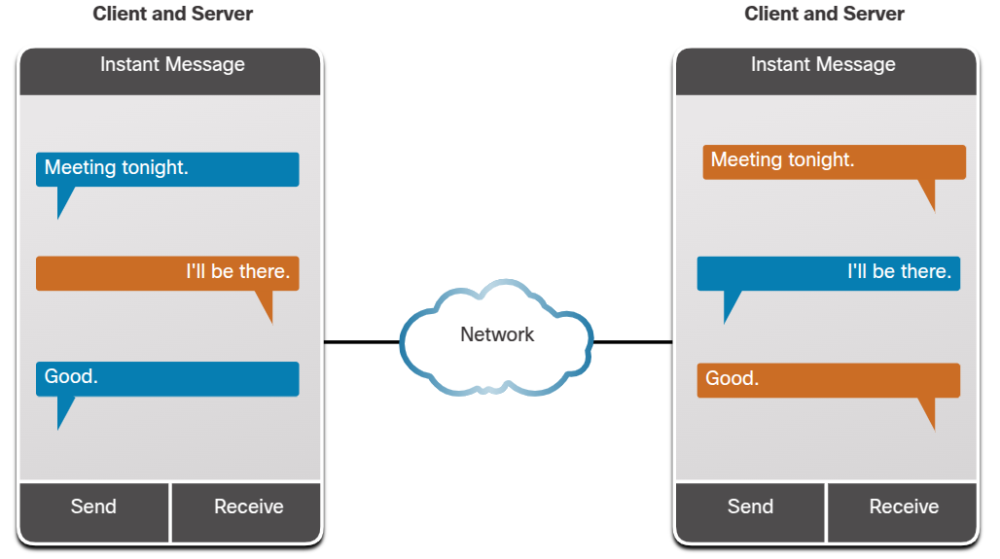
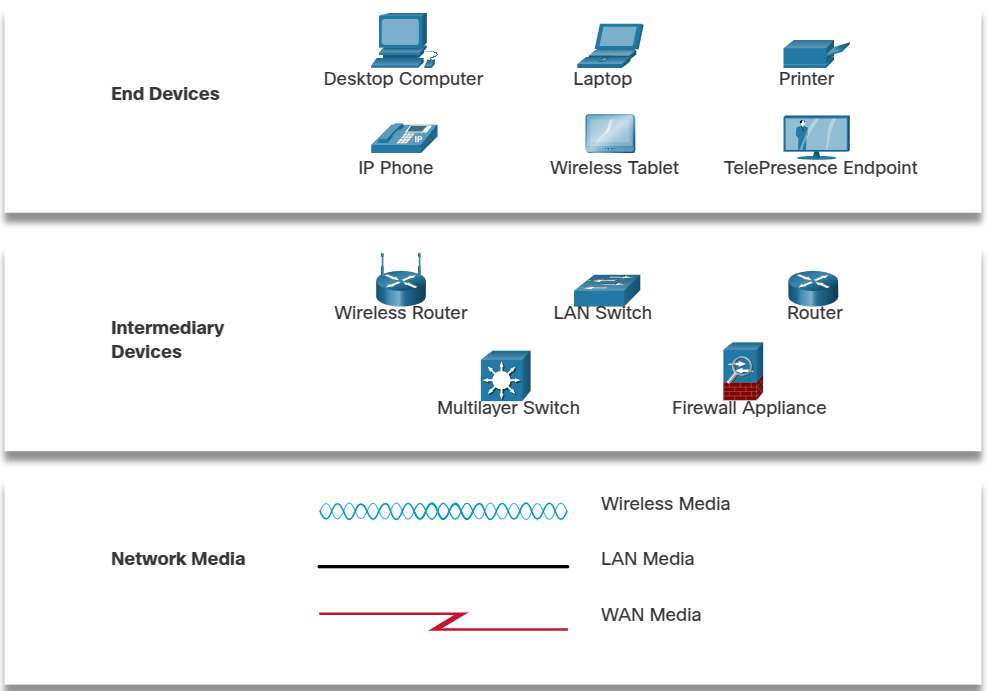
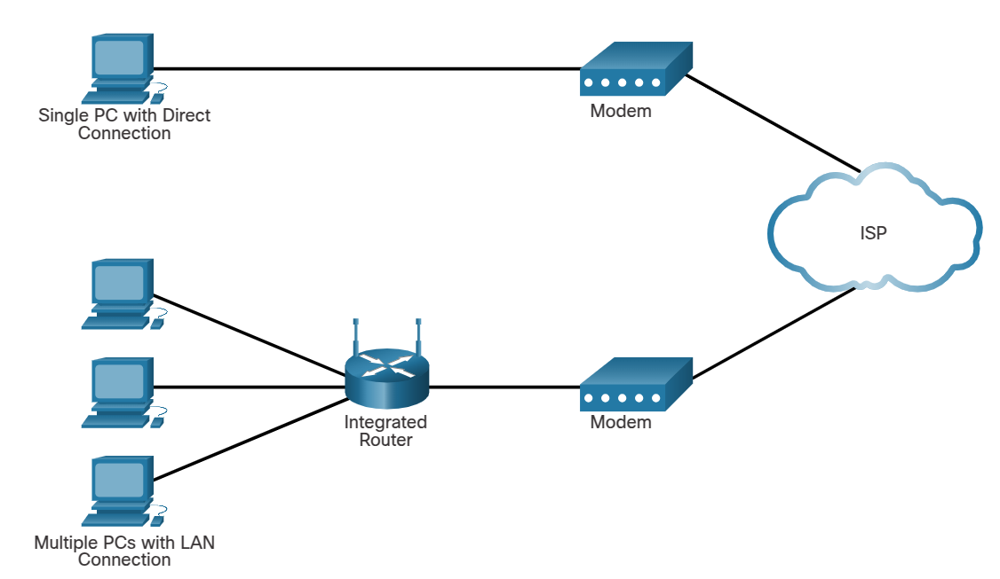

# Clients and Servers
Hosts: computer connected to a network that participate directly in network communication.  

Computer hosts can act as a client, a server, or both.
The software installed on the computer determines which role it plays.

- Server: provide information to other hosts on the network.
- Client: request and display the info obtained from the server.

## Client and Servers Roles
- Email: runs email server software. Client use mail client software, as Microsoft Outlook, Gmail.  
- Web: runs web server software. Client use browser software, as Vivaldi, Google Chrome, Falkon.  
- File: stores corporate and user files in a central location. Client devices access these files with client software, as Windows File Explorer.  

## Peer-to-Peer (P2P) Networks  
A network where computers function as the servers and clients.  

Advantages
- Easy to set-up.  
- Less complex.  
- Lower cost.  
- Can be used for simple tasks.  

Disadvantages
- No centralized administration.   
- Not as secure.  
- No scalable.  
- Can have a slower perfomance.  

### Applications
Require that each device provide a user interface and run a background service.  
Some use a hybrid system:
- The shared is decentralized.  
- The indexes that point to resource locations are stored in a centralized directory.  
- Each peer accesses an index server to get the location of a resource stored on another peer.  
- Both clients can simultaneously send and receive messages.  

## Multiple roles in the network
- A server can provide services for simultaneously to one or many clients.  
- A computer can run multiple types of server software (ex.: email, web and file server).  

## Questions
01. A computer that has software installed to provide information such as email or web pages to other devices is known as a:  
**a. server.** ✅    
b. smart host.  
c. smart phone.  
d. client.  

02. A smart phone uses web browser software to request and display a web page. The smart phone is considered what type of computer?  
a. smart host.  
b. server.  
**c. client.** ✅  
d. requester.  

03. A network where two computers are communicating with each other as both a client and as a server is known as a:  
a. server-to-server network.  
b. client-to-server network.  
**c. peer-to-peer network.** ✅  
d. client-to-client network.  

# Network infrastructure
The platform that supports the network. 
Three categories:  
- End devices.  
- Intermediate devices.  
- Network media.  

- Devices and media are the physical elements of networks.  
- Some of them may not be visible, such as radio frequences/infrared waves.  

## End devices or hosts
Interface between users and underlying communication network.  
- Either the source or destination of a message.  
- Uniquely indentified by addresses.  

## Questions

01. Marjani lives on a farm several kilometers outside of Msolwa, Tanzania. Which of the following end devices is she most likely to use to connect to the internet? (Choose two.)  
a. network printer.  
b. telepresence endpoint.  
**c. smartphone.** ✅  
d. wireless router.  
**e. wireless tablet.** ✅  

02. Eilert recently got a job with a computer support services company in his hometown of Falun, Sweden. A customer has asked for someone to come connect their home network to the internet. They only have a cable modem. Which of the following intermediary devices would Eilert most likely take with him to the job?  
a. LAN switch.  
b. desktop computer.  
**c. wireless router.** ✅  
d. firewall appliance.  
e. multilayer switch.  

03. Rosalía works as a community health worker in Rio Claro, Brazil. Most of her time is spent making home visits to provide primary care to people in her community. However, she requires internet access to maintain her patient records and provide videoconferencing with a doctor, when needed. What end device and media type does Rosalía most likely use? (Choose two.)  
**a. wireless media.** ✅  
b. router.  
c. WAN media.  
d. desktop computer.  
**e. tablet.** ✅  
f. LAN media.  

# ISP connections
Internet Service Protocol (ISP) provides the link between the home network and the internet.  
- Each ISP connects to other ISPs to form a network of links that interconnects users all over the world.  
- Primary medium that connects internet backbone is fiber-optic cable.  
- A router is required to securely connect a computer to an ISP (most common). 
- Bellow, a not protected connection (top) and a protected one (bottom).  

# Cable and DSL connections
- Cable: the internet data signal is carried on the same coaxial cable that delivers cable television.  
    - High bandwidth.  
    - Always on.  
    - Special cable modem separates the internet data signal from the others carried on the cable and provides an Ethernet connection to a host computer or LAN.  
- Digital Subscriber Liner (DSL): runs over a telephone line.
    - High bandwidth.  
    - Always on.  
    - Requires a special high-speed modem that separates the DSL signal from the telephone signal and provides an Ethernet connection to a host computer or LAN.  
    - Line split in three channels: 
        - Voice telephone calls: allows phone calls w/o disconnecting from the internet.  
        - Faster download: receive info from internet.  
        - Sending/upload information: usually slower than the download channel.  
    - Quality and speed depends mainly on the quality of the phone line and the distance from the central office of your phone company.  

# Additional connectivity options
- Celullar: uses a cell phone network to connect.
    - Limited by the capabilities of the phone and the cell tower to which it's connected.  
    - The carrier usually meters the bandwidth usage of connection and may charge extra for bandwidth.  
    - Good for people who are constantly on the move or in areas that would otherwise have no internet.  
- Satellite: 
    - Satellite dishes require a clear line of sight to the satellite and so might be difficult in places with overhead obstructions.  
    - Speeds vary depending on the contract.  
    - Equipment and installation costs can be high.  
    - Good for homes/offices that don't have access to DSL or cable.  
- Dial-up telephone:
    - Uses a phone line and a modem.  
    - Low bandwidth.  
    - Inexpensive option.  
    - Useful for mobile access while traveling.  

# Questions
01. What is a service that provides an internet data signal on the same network that delivers broadcast television and phone service?  
a. Guest access.  
b. Cellular data plan.  
**c. Cable internet.** ✅  
d. Digital Subscriber Line (DSL).  

02. What is a service that provides high bandwidth, always on, connection using existing land-line telephone wires?  
a. Cable internet.  
b. Cellular data plan.  
**c. Digital Subscriber Line (DSL).** ✅   
d. Guest access.  

03. What is an internet service that uses mobile phone networks to transmit data?  
a. Guest access.  
**b. Cellular data plan.** ✅  
c. Digital Subscriber Line (DSL).  
d. Cable internet.  

# Final questions

01. What type of network is defined by two computers that can both send and receive requests for resources?  
a. client/server.  
**b. peer-to-peer.** ✅  
c. enterprise.  
d. campus.  

02. What are two functions of end devices on a network? (Choose two.)  
**a. They originate the data that flows through the network.** ✅  
b. They direct data over alternate paths in the event of link failures.  
c. They filter the flow of data to enhance security.  
**d. They are the interface between humans and the communication network.** ✅  
e. They provide the channel over which the network message travels.  

03. A home user is looking for an ISP connection that provides high speed digital transmission over regular phone lines. What ISP connection type should be used?  
**a. DSL.** ✅  
b. dial-up.  
c. satellite.  
d. cell modem.  
e. cable modem.  

04. What type of internet connection would be best for a residence in a remote area without mobile phone coverage or wired connectivity?  
a. dial-up.  
b. cellular.  
**c. satellite.** ✅  
d. DSL.  

05. Which term correctly describes the function of an ISP?  
a. responsible for managing local networks.  
b. responsible for the maintenance of SOHO networks.  
**c. responsible for providing the link between a private network and the internet.** ✅  
d. responsible for providing security on private networks.  

06. Which device is an intermediary device?  
**a. firewall.** ✅  
b. PC.  
c. server.
d. smart device.  

07. Which scenario describes a peer-to-peer network?  
a. Users access shared files from a file server.  
b. A user visits a webpage on the company web site.  
**c. A user has shared a printer attached to the workstation.** ✅  
d. Users print documents from a network printer that has a built-in NIC.  

08. Which term is used to describe a network device with the primary function of providing information to other devices?  
a. workstation.  
b. console.  
**c. server.** ✅  
d. client.  

09. What is an advantage of the peer-to-peer network model?  
a. scalability.  
b. high level of security.  
**c. ease of setup.** ✅  
d. centralized administration.  

10. What is a characteristic of a peer-to-peer application?  
**a. Each device using the application provides a user interface and runs a background service.** ✅  
b. Each device can act both as a client and a server, but not simultaneously.  
c. The resources required for the application are centralized.  
d. One device is designated a server and one device is designated a client for all communications and services.  