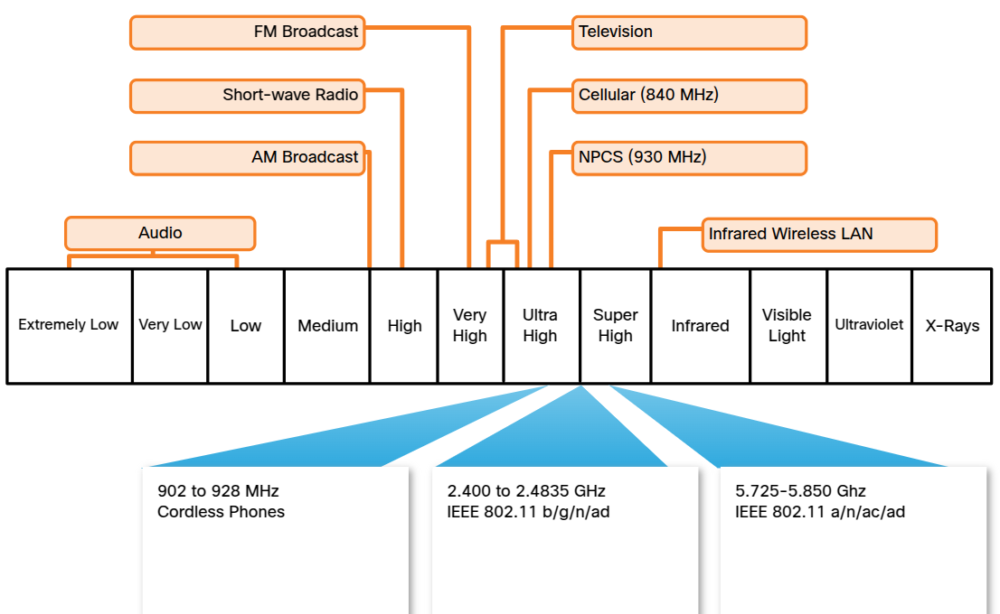

# Typical Home Network Setup
Most home network consist of at least two separate network.  
- Public: coming in from the service provider (cable or DSL provider).  
- Cable or DSL uses differents protocols and transmission methods as does Ethernet network.  
- Modem: converts the signals coming in from the provider. Input port coming from cable/DSL and output port that goes to the local home network.  
- Some home networking devices comes with the modem built in.  
- Almost all also provides wireless.  
- LAN usually are switched ports. 
- Routers: connect multiple networks and direct traffic between them. In a home network, the router connects your local network to the internet.

## Components of a home network
Home Wireless Local Area Network (WLAN)

## Typical Home Network Routers
Small business and home routers typically have two primary types of ports:
- Ethernet: connect to the internal switch portion of the router. 
    - Usually labeled “Ethernet” or “LAN”. 
    - All devices connected to the switch ports are on the same local network.
- Internet: connect the device to another network. 
    - Connects the router to a different network than the Ethernet ports. 
    - Often used to connect to the cable or DSL modem in order to access the internet.  

In addition to the wired ports, many home routers include a radio antenna and a built-in wireless access point.
- By default, the wireless devices are on the same local network as the devices that are physically plugged into the LAN switch ports. 
- The internet port is the only port that is on a different network in the default configuration.

# Questions
01. True or False?
A home router typically only provides wired access to the network. You have to buy a separate device for wireless access.
a. true.  
**b. false.** ✅  
02. Which of the following is used to connect a wired device to the internal switch of the home router?
**a. Ethernet port.** ✅ 
b. Power port.  
c. Wireless port.  
d. Internet port.  

# LAN wireless frequencies
Most wireless technologies used in home are in 2.4-5 GHz frequency ranges.

- Bluetooth: 
    - 802.15.  
    - Low speed.  
    - Short-range communications.  
    - Many devices at the same time (connect peripherals).  
- Modern LAN technologies:
    - 802.11.  
    - Higher power level.  
    - Great range.  
    - Improved throughput.  

# Wired network technologies
Ethernet protocol is the most commonly implemented wired protocol.  
- Allow network device to communicate over a wired LAN connection.  
- Directly connected devices use an Ethernet patch cable, usually unshielded twisted pair. 
    - Can be purchased with the RJ-45 connectors already installed.  
    - Come in various lengths.   
    - For those homes that don't have UTP wiring, there are other technologies (as powerline).  
Wired technologies:
- 5e: 
    - Most common wiring used in a LAN.  
    - Made up of 4 pairs of wires that are twisted to reduce electrical interference.  
- Coaxial cable: 
    - Has a inner wire surrounded by a tubular insulating layer, that is then surrounded by a tubular conducting shield.  
    - Most coax cables also have an external insulating sheath or jacket.  
- Fiber-optic:
    - Can be either glass or plastic.  
    - Diameter about the same as a human hair.
    - Can carry digital information at very high speeds over long distances. 
    - Very high bandwidth, carry very large amounts of data.

# Questions
01. True or False? Certain areas of the electromagnetic spectrum can be used without a permit.
    a. false
    **b. true** ✅

02. True or False? Wi-Fi, Bluetooth, and cordless phones all use the same frequency ranges.
    a. true
    **b. false** ✅

03. Which wired network technology has an inner wire surrounded by a tubular insulating layer, that is then surrounded by a tubular conducting shield?
    **a. Coaxial cable** ✅
    b. Fiber-optic cable
    c. Category 5 cable

# Wireless standards
A number of standards have been developed to ensure that wireless devices can communicate. 
- Specify the RF spectrum used, data rates, how the information is transmitted, and more.
- Institute of Electrical and Electronics Engineers (IEEE): creation of wireless standards.  
- IEEE 802.11: WLAN environment. 2.4-5 GHz frequency bands. Wi-Fi.
- Wi-Fi Alliance: test wireless LAN devices from different manufacturers.  

# Wireless settings
Wireless routers using the 802.11 standards have multiple settings that have to be configured. These settings include the following:
- Network mode: determines the type of technology that must be supported. Ex.: 802.11b,802.11g,802.11n or Mixed Mode.
- Network Name (SSID): identify the WLAN. All devices that wish to participate in the WLAN must have the same SSID.
- Standard Channel: specifies the channel over which communication will occur. By default, this is set to Auto to allow the access point (AP) to determine the optimum channel to use.
- SSID Broadcast: Determines if the SSID will be broadcast to all devices within range. By default, set to Enabled.  

# Network mode
- 802.11 protocol can provide increased throughput based on the wireless network environment. 
- If all wireless devices connect with the same 802.11 standard, maximum speeds can be obtained for that standard. 
- If the access point is configured to accept only one 802.11 standard, devices that don't use that standard cannot connect to the access point.
- Mixed mode can include devices that use any of the existing Wi-Fi standards. 
    - Provides easy access for older devices.
- SSID: a case-sensitive, alphanumeric string that contains up to 32 characters.
    - Sent in the header of all frames transmitted over the WLAN.  
    - Used to tell wireless devices, called wireless stations (STAs), which WLAN they belong to and with which other devices they can communicate.
    - Identify a specific wireless network.  
    - Name of the network. 
    - Wireless routers usually broadcast their configured SSIDs by default. 
    - SSID broadcast allows other devices and wireless clients to automatically discover the name of the wireless network. 
    - When disabled, you must manually enter the SSID on wireless devices.
        - Can make it more difficult for legitimate clients to find the wireless network. 
        - Simply turning off the SSID broadcast isn't sufficient to prevent unauthorized clients.  

# Question
01. Which organization is responsible for testing wireless LAN devices?
    a. **Wi-Fi Alliance** ✅
    b. IEEE
    c. TIA/EIA
    d. IETF

02. What is used to identify a specific wireless network?
    a. the IP address of the router
    b. **the Service Set Identifier (SSID)** ✅
    c. the network address
    d. the network mode

03. True or False? If you have devices on your wireless network that are using a variety of different 802.11 standards, then you should set your network to the highest standard to get the best throughput.
    a. **false** ✅
    b. true

# Setup a home router
To connect to the router using a wired connection:
- Plug an Ethernet patch cable into the network port on the computer.  
- Plug the other end into a LAN port on the router.  
- Don't plug the cable into "Internet" (DSL/cable).  
- If built-in modem for internet connections, verify if the type of connection is correct for your internet service.  
- Cable modem: will have a coaxial terminal to accept a BNC-type connector.  
- DSL connection: will have a port for a telephone-type cable (usually RJ-11).  
After connected to the network and the link lights on the NIC indicates a working connection, the computer needs an IP:
- Most receives automatically from a local DHCP server configured on the wireless router.  
- If the computer doesn't have an IP: configure the PC with a unique IP address, subnet mask, default gateway, and DNS information.  

## Design considerations
- Network name (SSID):
    - If broadcasting on, SSID name will be seen by all wireless clients within your signal range.  
    - SSID TMI:
        - Doesn't include the device or brand name
## Wireless devices
- Wireless devices contain radio transmitter/receivers that function within a specific frequency range. 
- If a device only has the necessary radio for 802.11 b/g, it won't connect if the wireless router or access point is configured to only accept 802.11n or 802.11ac standards. 
- If all devices support the same standard -> the network will work at its optimum speed.  
- If a device don't support n or ac standards -> enable legacy mode. 
    - A legacy mode wireless network environment varies between router models but can include a combination of 802.11a, 802.11b, 802.11g, 802.11n, and 802.11ac. 
## How to add new devices
- Who can access your home network: should be determined by how you plan to use the network. 
- On some wireless routers, it is possible to set up guest access. 
    - A special SSID coverage area that allows open access but restricts that access to using the internet only.
- Some wireless routers may label legacy mode as mixed mode.

