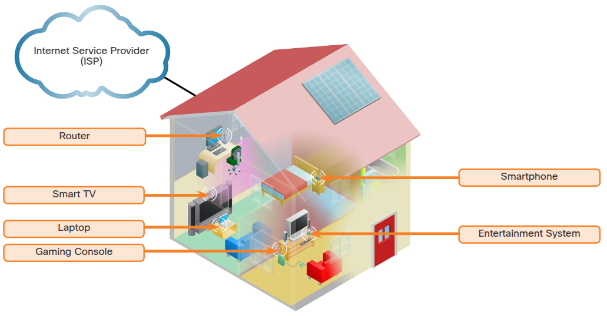
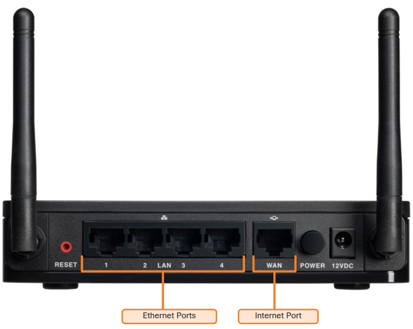

# Typical Home Network Setup
Most home network consist of at least two separate network.  
- Public: coming in from the service provider (cable or DSL provider).  
- Cable or DSL uses differents protocols and transmission methods as does Ethernet network.  
- Modem: converts the signals coming in from the provider. Input port coming from cable/DSL and output port that goes to the local home network.  
- Some home networking devices comes with the modem built in.  
- Almost all also provides wireless.  
- LAN usually are switched ports. 
- Routers: connect multiple networks and direct traffic between them. In a home network, the router connects your local network to the internet.

## Components of a home network
Home Wireless Local Area Network (WLAN)

## Typical Home Network Routers
Small business and home routers typically have two primary types of ports:
- Ethernet: connect to the internal switch portion of the router. 
    - Usually labeled “Ethernet” or “LAN”. 
    - All devices connected to the switch ports are on the same local network.
- Internet: connect the device to another network. 
    - Connects the router to a different network than the Ethernet ports. 
    - Often used to connect to the cable or DSL modem in order to access the internet.  

In addition to the wired ports, many home routers include a radio antenna and a built-in wireless access point.
- By default, the wireless devices are on the same local network as the devices that are physically plugged into the LAN switch ports. 
- The internet port is the only port that is on a different network in the default configuration.

# Questions
01. True or False?
A home router typically only provides wired access to the network. You have to buy a separate device for wireless access.
a. true.  
**b. false.** ✅  
02. Which of the following is used to connect a wired device to the internal switch of the home router?
**a. Ethernet port.** ✅ 
b. Power port.  
c. Wireless port.  
d. Internet port.  

